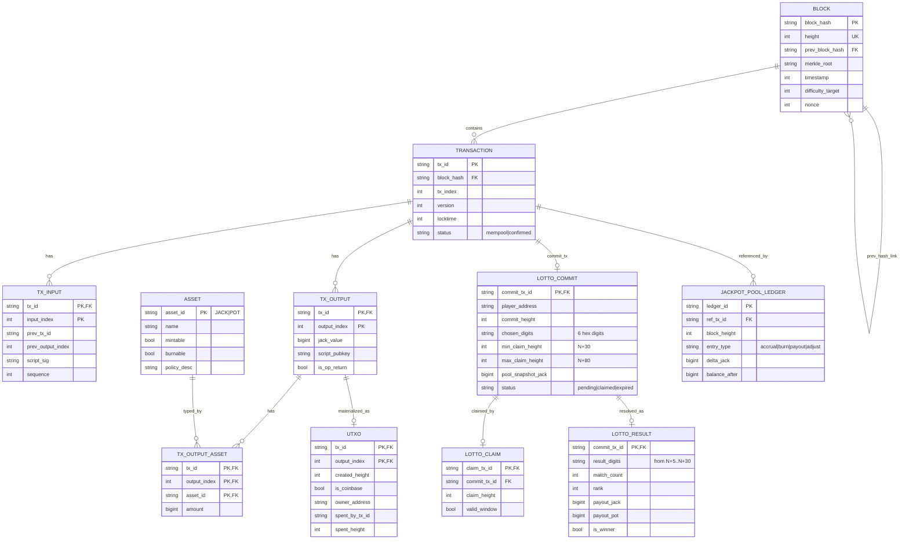

# ERD (논리 데이터 모델)

## 목적
- JackpotChain의 구현/검증 단위를 엔터티 관계로 정리한다.
- 관계형 DB 강제가 아니라, 파일 저장소/인덱스/메모리 구조까지 포함한 논리 ERD다.
- 가챠 도메인은 `16-2-gacha-system-final.md` 기준(6블록 비교 로또형)으로 설계한다.

## Mermaid ERD

## 엔터티 설명 요약
- `BLOCK`: 체인의 기본 단위. `prev_block_hash`로 자기참조 관계를 가진다.
- `TRANSACTION`: 블록에 포함되는 원자 이벤트. 버전으로 일반/교환/가챠 타입을 구분한다.
- `TX_INPUT`/`TX_OUTPUT`: UTXO 소비/생성의 최소 단위.
- `TX_OUTPUT_ASSET`: 출력의 멀티에셋 수량(JACK 외 POT 등) 확장 테이블.
- `UTXO`: 미사용 출력의 현재 상태(빠른 검증용 물질화 뷰 성격).
- `ASSET`: 자산 정책 메타.
- `LOTTO_COMMIT`: 로또 참여 기록(숫자 선택, 높이, 만료 구간, 풀 스냅샷).
- `LOTTO_CLAIM`: 청구 트랜잭션 매핑.
- `LOTTO_RESULT`: 결과 계산 및 보상 산출 기록.
- `JACKPOT_POOL_LEDGER`: 풀 잔액 증감 이력.

## 핵심 제약조건
- `TX_INPUT(prev_tx_id, prev_output_index)`는 과거 `TX_OUTPUT`를 참조해야 한다.
- `UTXO`는 `spent_by_tx_id IS NULL`인 출력만 유지한다.
- `LOTTO_COMMIT`은 반드시 가챠 Commit TX(`version=3`)와 1:1이다.
- `LOTTO_CLAIM`은 `N+30 <= claim_height <= N+80` 범위를 만족해야 한다.
- 1등 보상은 `LOTTO_COMMIT.pool_snapshot_jack * 0.5`를 사용한다.

## 구현 메모
- 현재 코드베이스는 파일 저장소(`storage/database.py`) + 인메모리 인덱스 성격이므로, 위 ERD를 그대로 SQL로 옮길 필요는 없다.
- 다만 테스트/검증/리팩토링 시 위 엔터티 경계를 기준으로 API와 상태전이를 점검하면 일관성을 유지하기 쉽다.
